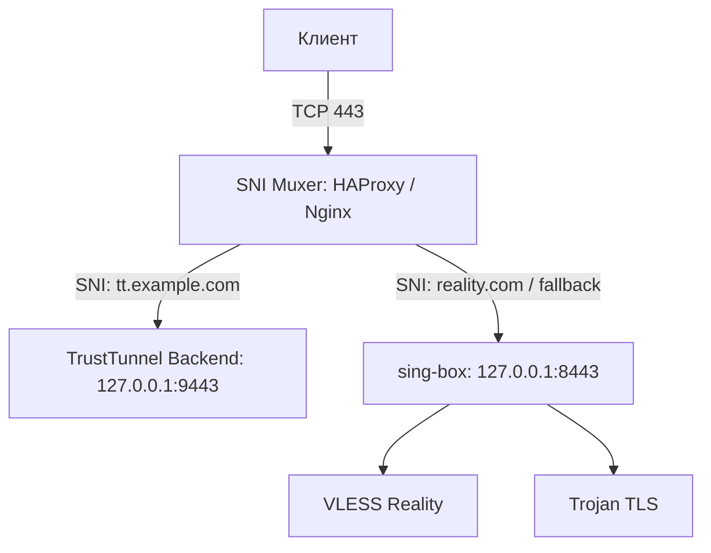

# Техническое решение: Совместное использование порта 443 (TrustTunnel + VLESS Reality + Trojan + Hy2)

## 1. Описание проблемы
На текущем сервере порт `443` является критическим ресурсом:
- **VLESS Reality (TCP/443)**: Требует 443 порт для имитации реального сайта (маскировка).
- **Hysteria2 (UDP/443)**: Использует UDP для высокой производительности.
- **TrustTunnel (сейчас 9443)**: Пользователь хочет перенести его на 443, чтобы обходить жесткие корпоративные файерволы, разрешающие только стандартные порты.

Основная сложность — совместить **Reality** (который должен быть "лицом" сервера) и **TrustTunnel** (который также хочет быть на 443) на одном IP.

## 2. Целевая архитектура (SNI Muxing)

Решение базируется на использовании фронт-прокси (SNI Proxy), который анализирует заголовок SNI (Server Name Indication) в TLS-пакете и перенаправляет поток на нужный бэкенд без расшифровки трафика.

### Схема TCP (Порт 443):


### Схема UDP (Порт 443):
UDP-трафик на порту 443 безоговорочно отдается **Hysteria2**. 
*Обоснование:* Мультиплексирование UDP по SNI невозможно (в общем случае), а Hysteria2 критично важна работа именно на 443/UDP для пробива ограничений. TrustTunnel будет работать через TCP-мультиплексор (443/TCP), что покрывает 99% кейсов.

## 3. Варианты реализации

### Вариант А: HAProxy (Рекомендуемый)
**Почему:** Самый производительный и прозрачный способ проксирования TCP. Минимальное влияние на TLS-fingerprint (важно для Reality).
- **Плюсы:** Высокая надежность, отличная поддержка SNI.
- **Минусы:** Новый компонент в системе.

### Вариант Б: Nginx (Stream module)
**Почему:** Если Nginx уже установлен для веб-сайта, проще использовать его.
- **Плюсы:** Универсальность.
- **Минусы:** Чуть более громоздкий конфиг для Stream.

### Вариант В: sing-box (Internal route)
**Почему:** Минимизация количества софта.
*Примечание:* sing-box может выступать в роли SNI-прокси через `inbound` типа `direct` (в новых версиях) или `vless` с `dest`. Однако это усложняет логику Reality.

**Выбранный вариант:** **HAProxy** как наиболее стабильный и "чистый" для задачи разделения трафика без дешифрации.

## 4. Конфигурационные блоки

### 4.1. HAProxy (/etc/haproxy/haproxy.cfg)
```haproxy
frontend https_front
    bind :443
    mode tcp
    tcp-request inspect-delay 5s
    tcp-request content accept if { req_ssl_hello_type 1 }

    # Маршрутизация TrustTunnel (по поддомену)
    use_backend trusttunnel_backend if { req_ssl_sni -i tt.yourdomain.com }
    
    # Все остальное (включая Reality) — в sing-box
    default_backend singbox_backend

backend trusttunnel_backend
    mode tcp
    server tt_local 127.0.0.1:9443

backend singbox_backend
    mode tcp
    server sb_local 127.0.0.1:8443
```

### 4.2. sing-box (vpn-server.json)
Изменяем порт прослушивания для VLESS Reality:
```json
{
  "inbounds": [
    {
      "type": "vless",
      "tag": "vless-in",
      "listen": "127.0.0.1",
      "listen_port": 8443,
      "tls": {
        "enabled": true,
        "reality": {
            "enabled": true,
            "handshake": { "server": "www.google.com", "server_port": 443 }
            // ... остальные настройки
        }
      }
    }
  ]
}
```

## 5. Шаги внедрения

1.  **Подготовка DNS**: Направить `tt.yourdomain.com` и основной домен на IP сервера.
2.  **Установка HAProxy**: `apt install haproxy`.
3.  **Перенастройка sing-box**: 
    - Сменить `listen_port` VLESS с 443 на 8443.
    - Оставить Hysteria2 на `0.0.0.0:443` (UDP).
4.  **Настройка TrustTunnel**: Убедиться, что он слушает `127.0.0.1:9443` (TCP).
5.  **Запуск HAProxy**: Применить конфиг и перезапустить.

## 6. Риски и ограничения

1.  **UDP для TrustTunnel**: На порту 443/UDP будет только Hysteria2. Клиенты TrustTunnel должны использовать TCP-режим для порта 443.
2.  **Reality Fingerprinting**: Хотя HAProxy работает в режиме TCP (без дешифрации), теоретически DPI может заметить минимальные задержки, вносимые прокси. На практике это редко является проблемой.
3.  **IPv6**: Требуется аналогичная настройка для IPv6 адресов.
4.  **Split-routing**: Изменения не затрагивают внутреннюю маршрутизацию (tun/ss-egress), так как меняется только способ попадания трафика *в* сервер.

## 7. Тест-план

1.  Проверить подключение VLESS Reality через порт 443 (через HAProxy).
2.  Проверить подключение TrustTunnel через `tt.yourdomain.com:443`.
3.  Проверить, что Hysteria2 (UDP/443) продолжает работать (напрямую, мимо HAProxy).
4.  Проверить Trojan (через HAProxy, если настроен SNI, или на отдельном порту 2053).
